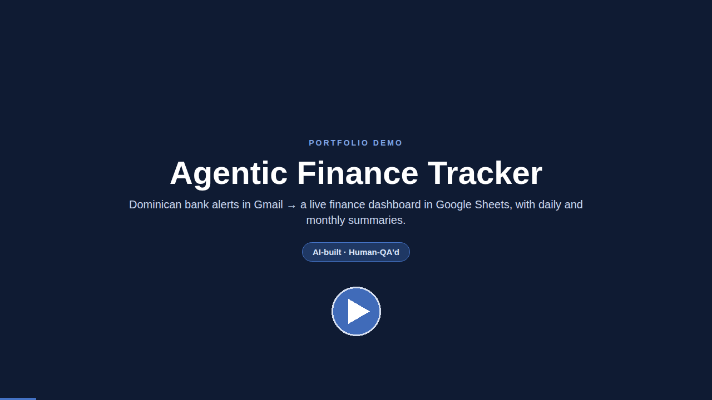
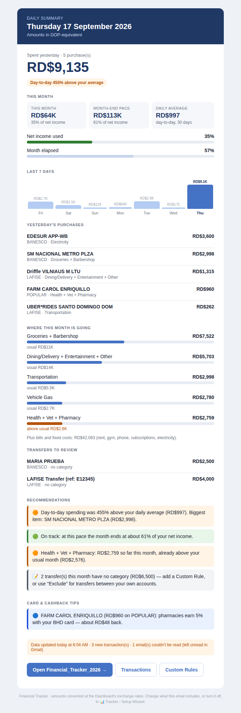
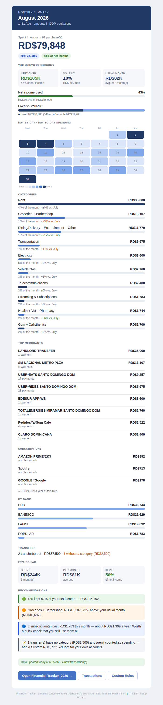
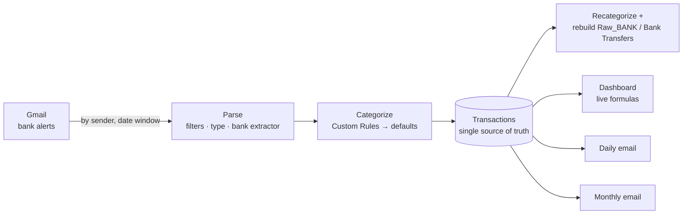

# agentic-fin-tracker

[](https://github.com/joaquinganan/agentic-fin-tracker/actions/workflows/tests.yml)

A personal-finance tracker that reads the transaction alerts Dominican banks send by email (LAFISE, BANESCO,
BHD, POPULAR, BDI), turns them into categorized transactions in Google Sheets, keeps a live Dashboard, and sends
a daily and a monthly summary email. It runs on Google Apps Script, bound to the spreadsheet, with no servers or
paid services.

> **An AI-built system, quality-assured by a human.**
> Every line of code in this repository — the Apps Script system and the automated test suite — was written by
> AI (Anthropic's Claude) through conversation. **[Joaquín Gañán](https://github.com/joaquinganan)** did,
> essentially, everything a QA engineer does: defined what the system had to do, tested it against real data,
> found and documented the defects, decided what "fixed" meant, and verified every release.

### ▶ Demo (under a minute)

<p align="center">
  <a href="https://joaquinganan.dev/demos/agentic-fin-tracker.html">
    
  </a>
</p>
<p align="center"><sub>
  <a href="https://joaquinganan.dev/demos/agentic-fin-tracker.html">Watch on joaquinganan.dev</a> ·
  <a href="docs/demo/agentic-fin-tracker-demo.mp4">MP4 in this repo</a> —
  all data is synthetic; the parser output, Setup Wizard, emails and test run are renders of the real code, and the
  Dashboard scene recreates its layout (Google Sheets can't be rendered outside Sheets).
</sub></p>

<p align="center">
  
  &nbsp;
  
</p>
<p align="center"><sub>Daily and monthly summary emails, rendered with synthetic data.</sub></p>

---

## How it was built — the QA role

The AI wrote the code; the quality came from the QA loop around it. Joaquín's work on the project:

- **Requirements and acceptance.** Defined the features, the Dashboard and email behaviour, the category rules
  for his real merchants, privacy constraints, and accepted or rejected each release.
- **Exploratory testing in production.** Ran every release against his real Gmail and real bank alerts, and
  reviewed the resulting rows, categories and Dashboard numbers line by line.
- **Defect reporting with evidence.** Reported each problem with the artifacts needed to reproduce it:
  screenshots of the affected rows, Apps Script execution logs, and the original `.eml` of the offending email.
  Most root causes were only visible in those real samples — see the table below.
- **Test data.** Supplied the real bank emails that became the (anonymized) fixtures of the regression suite.
- **Release verification.** Checked the deployed version in the execution log (`SCRIPT_VERSION`) before
  re-testing — several "still broken" reports turned out to be undeployed code, which is why that check exists.
- **Scope and risk calls.** Requested a full code review and had every finding implemented — including the
  automated test suite it recommended — and a privacy pass (no personal data in code, docs or tests).

### Defects found through QA

A selection of real defects — most found by testing with real data, some by code review — each now covered by
an automated test.

| Defect | Evidence | Root cause | Fixed |
|---|---|---|---|
| Paying the credit card counted as a new expense | Screenshot of card-payment rows | The real subject used a different wording than the guessed keyword | v1.1.17 |
| A real merchant rewritten as "unparsed" on every run | `.eml` sample | A "garbled text" rule matched a legitimate name (`HOLA …`) and ran in every recategorize | v1.1.18 |
| The last day of every month never imported | Code review, then simulation | Gmail's `before:` is exclusive; the run on the 1st searched an empty window | v1.1.19 |
| A restaurant purchase typed as a bank transfer | Code review, confirmed on the real `.eml` | Substring match: `ACH` inside "CACHAREPA" | v1.1.19 |
| A declined charge saved as spending, plus the balance as a 2nd row | Found while fixing the above | The generic fallback ran after the row-level "declined" filter | v1.1.19 |
| A card reversal saved as a new expense | `.eml` of both emails in the thread | "Reversada" rows with no merchant weren't recognized | v1.1.23 |
| The same transfer notice counted twice | Screenshot of the Gmail thread | Two emails, identical content → two message ids | v1.1.23 |
| The daily 6 AM run never worked | Production runs | `SpreadsheetApp.getUi()` doesn't exist in a time-triggered run | v1.1.12 |
| Two real purchases on the same day and amount → one lost | Production data | Deduplication compared only day + amount | v1.1.13 |
| Every emoji in the summary email arrived as "������" | Screenshot of the email | `GmailApp.sendEmail` breaks characters outside Unicode's BMP | v1.1.25 |

The full history — what was wrong, how it was found and what changed — is in [CHANGELOG.md](CHANGELOG.md).

---

## What it does

- **Reads bank alerts** from Gmail by sender, for purchases, transfers and card payments, with an extractor per
  bank and alert type built from real emails, plus a generic fallback.
- **Categorizes** with ordered keyword rules plus your own **Custom Rules** (including `Exclude`, for transfers
  between your own accounts). Card payments are excluded automatically; reversals are saved as negative rows that
  cancel the original purchase.
- **Deduplicates** by Gmail message id and by the bank's own reference number.
- **Investments** (Investment Ledger → Holdings): broker emails (HAPI orders and dividends), deposits from bank
  transfers, snapshots and balances for funds or pensions; positions valued live with `GOOGLEFINANCE`.
- **Readable data sheets:** a coloured chip per category, and the rows that need attention — transfers without a
  category, unreadable merchants — highlighted automatically.
- **Dashboard** with KPI cards, categories by month, fixed vs. variable, spend by bank, a year heat map, and a
  "Which card for what" cashback matrix. It converts USD/EUR/COP to DOP at editable rates.
- **Dominican payroll deductions** for DOP salaries: automatic ARS/SFS, AFP (with 2026 caps) and ISR (DGII
  scale), or entered manually — plus other monthly income, added with no deductions.
- **Your credit cards** (set in the Setup Wizard): card, statement and payment days, with cashback rates and
  rules from a catalogue of each program's public terms.
- **Daily email:** yesterday's spending, month pace against income, last 7 days, categories against their usual
  month, transfers to review, rule-based recommendations, card tips and a data-health line.
- **Monthly email** (on the 1st): left over and savings rate, comparisons, a day-by-day heat calendar,
  subscriptions detected, cashback left on the table, and year to date.



---

## Repository layout

```
src/                  Apps Script sources (bound to the spreadsheet) + appsscript.json
  01_main.gs          menu, Setup Wizard, config, triggers, run pipeline, DR payroll
  02_categorizer.gs   categories, shared keyword engine, Custom Rules
  03_gmailMonitor.gs  Gmail search, filters, type detection, bank extractors
  04_sheetsWriter.gs  save / dedup, recategorize, derived sheets, Dashboard
  05_dailySummary.gs  email kit + daily summary
  06_monthlySummary.gs monthly summary
  07_investments.gs   investment ledger, broker emails, holdings
tests/                automated test framework (see below)
docs/USER_GUIDE.md    setup and day-to-day use
CHANGELOG.md          every release, with the defect behind it
```

## Getting started

Follow **[docs/USER_GUIDE.md](docs/USER_GUIDE.md)**: create a Google Sheet, open *Extensions › Apps Script*,
add the seven files from `src/`, run `onOpen` once to authorize, then use **📊 Tracker › Setup Wizard**.

With [clasp](https://github.com/google/clasp), you can push from this repo instead: copy `.clasp.json.example`
to `.clasp.json`, set your script id, then run `clasp push`.

---

## Test automation framework

The Apps Script code runs unchanged in Node — no transpiling, no dependencies:

```
npm test            # node --test tests/*.test.js  (Node 18+)
```

- **Harness** (`tests/harness.js`). Loads the six `.gs` files into **one shared V8 context**, exactly as Apps
  Script does, with small stubs for `Logger`, `Session` and `Utilities`. `GS_ROOT=<dir>` runs the same suite
  against another copy of the code. This is how every fix was checked against the previous version, to prove the
  test really catches the bug.
- **Strict mock** (`tests/sheets_mock.js`). An in-memory `SpreadsheetApp`, `GmailApp`, `LockService`,
  `ScriptApp`, `PropertiesService` and `HtmlService`. Calling an API method that doesn't exist throws, as does
  writing outside a sheet's size, merging over an existing merge, or writing a value under a merged cell.
  `getUi()` throws as in a time-triggered run, so layout and API mistakes fail here, not in production.
- **Real fixtures** (`tests/fixtures/`). Anonymized bodies of real bank emails (and a few synthetic ones based on
  confirmed formats), each with its expected transactions in `manifest.json`, run end to end through the parser.
- **Formula lint.** Every Dashboard formula is checked for balanced syntax, real Sheets functions only, and
  existing named ranges.
- **Rendering checks.** Both emails are verified to be ASCII-only HTML (because of the Gmail emoji defect), and
  were reviewed rendered in Chromium at desktop and mobile widths.
- **Privacy guards.** Tests fail if the code contains a personal email address, a numeric placeholder in the Setup
  Wizard, or a hard-coded statement date.
- **CI.** GitHub Actions runs the suite on Node 20 and 22 on every push and pull request.

| Suite | Focus |
|---|---|
| `categorizer.test.js` | keyword engine, categories, Custom Rules |
| `parsing.test.js` | type detection, every fixture end to end, declined rows, balances |
| `pipeline.test.js` | date windows, dedup, reversals, recategorize rules, run summary |
| `integration.test.js` | full runs against the mock; Dashboard lint, wiring and migrations |
| `v124.test.js` | DR payroll, Setup Wizard, privacy, column auto-fit, daily email |
| `v126.test.js` | email redesign, monthly summary, triggers, data health |
| `v127.test.js` | other income, credit cards from the Setup Wizard, save flow and messages |
| `v128.test.js` | category colours (WCAG AA), data-sheet highlights, Bank Transfers Category column |
| `v129.test.js` | investments: HAPI emails, holdings maths, a full run from emails and bank deposits to Holdings |

Adding a real email as a new fixture, and the manual checks a mock can't cover, are described in
[tests/README.md](tests/README.md).

---

## Privacy

The code contains no personal data: the Setup Wizard suggests the email of the Google account that opens it, and
every other default is empty. Test fixtures are anonymized: names, card and account numbers, and confirmation
numbers were replaced. Summary emails are sent from the user's own Gmail. Nothing leaves Google's services.

## License

Built collaboratively with AI (Claude). Free to use, modify and adapt.
